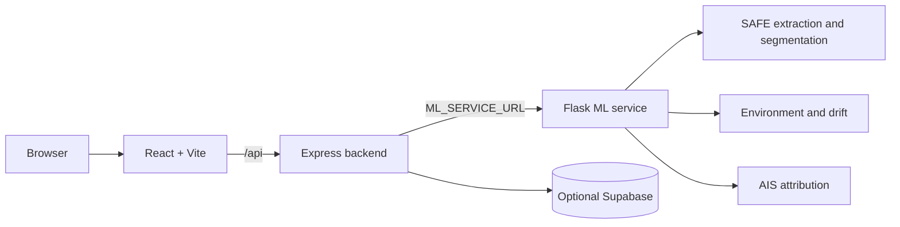

# Architecture

## Service topology



The browser only uses Express. Express writes incoming uploads to disk, streams them to Flask, proxies job progress and generated files, and persists completed prediction records when Supabase is configured.

## Component boundaries

| Boundary | Input | Output | Reason for the boundary |
|---|---|---|---|
| Browser to Express | User actions, multipart SAFE upload, result queries | JSON, SSE, proxied artifacts | Keeps the browser independent of ML-service location and internal files. |
| Express to Flask | Disk-streamed SAFE archive and analysis parameters | ML job snapshots and artifact streams | Prevents large archives from being held entirely in Node memory. |
| Flask to pipeline | Validated SAFE upload and job options | Stage updates, result object, generated files | Separates HTTP/job management from scientific processing. |
| Pipeline to providers | Location, acquisition time, origin/time window | Environmental and AIS evidence | Makes external-data limitations explicit in the result. |
| Express to Supabase | Completed prediction record | Persisted completed history | Adds optional durability without changing active-job behaviour. |

## Data flow

```text
SAFE archive
  -> backend/uploads/ temporary file
  -> streaming multipart request
  -> ml_service/uploads/ working copy
  -> SAFE extraction + nine-stage pipeline
  -> ml_service/outputs/<job-id>/ artifacts
  -> completed ML result JSON
  -> backend prediction record
  -> optional Supabase persistence and frontend results/history
```

The backend removes its temporary upload after Flask has received the stream. Flask removes its working input best-effort after the job. Generated output artifacts are retained locally by job ID and are served through the backend file proxy.

## Job lifecycle

1. Express receives a SAFE archive and forwards it to Flask.
2. Flask saves a uniquely named upload and creates an in-memory `queued` job.
3. `JobManager` starts a background thread and Flask returns `202` immediately.
4. The pipeline reports stage changes through a callback.
5. The frontend polls or consumes Server-Sent Events until a terminal job state.
6. Express converts a completed ML result to a prediction record and exposes its ID.

Jobs are not durable and are not shared between processes.

### Job and stage state

```text
Job:   queued -> processing -> complete
                         -> failed
       queued/processing -> cancelled

Stage: pending -> running -> success | warning | error | skipped
```

An SSE client receives a full job snapshot whenever Flask observes a change. The frontend can fall back to polling the same job endpoint. When the job reaches `complete`, the frontend performs a metadata-aware status request through Express so the backend can create exactly one prediction record and return its `predictionId`.

## Nine-stage pipeline

| Stage | Responsibility |
|---|---|
| `extraction` | Validate SAFE structure and read metadata/VV/VH measurement bands. |
| `preprocessing` | Prepare calibrated model input. |
| `model_inference` | Run segmentation with test-time augmentation. |
| `segmentation` | Create mask, overlay, thumbnail, and detection statistics. |
| `geolocation` | Convert the detected slick to product-referenced coordinates and polygon patches. |
| `environmental_data` | Retrieve available wind/current history. |
| `drift_hindcast` | Estimate likely prior origin and release time. |
| `drift_forecast` | Project the slick forward, 24 hours by default. |
| `vessel_attribution` | Retrieve and rank candidate vessels from available AIS evidence. |

No-spill detections skip downstream work. Data-quality limitations are surfaced through `warning` or `skipped` stage statuses.

## Result composition

The pipeline result is deliberately richer than the history record. It contains raw detection information, SAFE metadata, geolocation, environmental conditions, hindcast/forecast summaries, candidates, and generated-file basenames. The backend maps those values into a stable prediction shape suitable for list filtering, alerts, map rendering, and detail views.

This means a change to an ML result field should be checked in three places: the pipeline output, `backend/data/store.js` mapping, and the frontend component that renders the mapped field.

## Persistence model

Supabase is optional. When absent, the backend maintains completed predictions in memory. When present, the backend can hydrate completed prediction history on startup and write new completed records. The Flask job manager remains in memory in both modes, so a restart during analysis always loses the active job.

## Failure boundaries

- A malformed SAFE archive fails extraction and marks the job failed.
- A missing model keeps Flask alive in `degraded` state, but new analysis submissions return `503`.
- Missing environment or AIS coverage normally becomes a stage warning or unavailable result rather than a fabricated value.
- A browser disconnect closes its own SSE connection; it does not necessarily cancel the underlying job. Explicit cancellation uses the cancel endpoint.

## Runtime files

- `backend/uploads/` — temporary gateway-side uploads.
- `ml_service/uploads/` — Flask-side working copies.
- `ml_service/outputs/<job-id>/` — masks, overlays, trajectories, and maps.

See the [API reference](api.md) for endpoint details and [configuration](configuration.md) for service settings.
