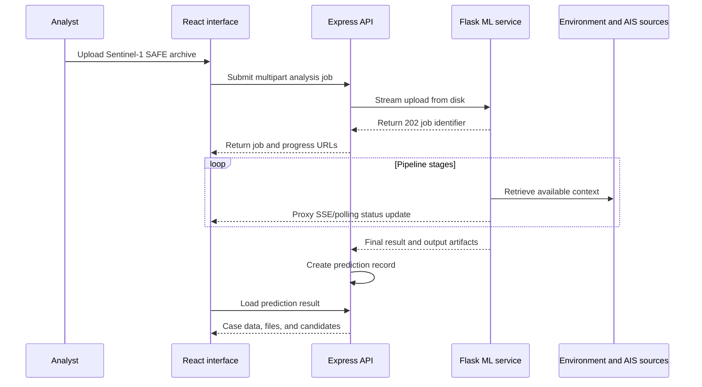

# Full project summary

## Purpose

VarunaDrishti is a local-first maritime investigation platform for analysing Sentinel-1 Synthetic Aperture Radar (SAR) SAFE archives. A radar scene can show a possible slick after it has already travelled from its release point, so the project combines image segmentation with geographical, environmental, and vessel evidence instead of presenting a model classification in isolation.

The system helps an analyst answer four questions:

1. Is the scene consistent with a possible oil slick?
2. Where is the detected slick and how large is its mapped footprint?
3. Where may it have originated, and where could it move next?
4. Which evaluated vessels are relatively most consistent with the available evidence?

Vessel ranking is investigative support only. It must not be interpreted as a finding of legal responsibility or causation.

## End-to-end workflow

1. The analyst uploads a complete `.SAFE.zip` product.
2. The frontend submits the file to Express and opens live job status.
3. Express writes the upload to disk, then streams it to Flask so the archive is not retained in Node memory.
4. Flask creates a background job and returns immediately.
5. The nine-stage pipeline extracts SAFE information, runs detection, retrieves evidence, and creates artifacts.
6. Express converts a completed ML result into the prediction-record shape used by the UI.
7. The analyst reviews maps, reports, generated files, candidate vessels, and history.

## System components

| Component | Main technologies | Responsibilities |
|---|---|---|
| `frontend/` | React 18, Vite, React Router, Framer Motion | SAFE upload, progress display, result map, history, batch processing, and case UI. |
| `backend/` | Node.js, Express, Multer, Axios | Browser API, disk-backed upload forwarding, Flask proxying, result storage, alerts, and batches. |
| `ml_service/` | Python, Flask, PyTorch | SAFE extraction, model inference, geolocation, environmental lookup, drift, and attribution. |
| Mapping | Leaflet, React Leaflet, OpenStreetMap | Slick polygons, trajectories, origin, and vessel context. |
| Optional persistence | Supabase PostgreSQL | Completed-record history and optional remote current observations. |
| External evidence | Open-Meteo, Copernicus observations, GFW, AISStream | Environmental and vessel context when coverage and credentials exist. |

## Frontend behaviour

The frontend route definitions are in `frontend/src/App.jsx`.

| Route | Screen | Primary purpose |
|---|---|---|
| `/` | `NewPrediction.jsx` | New SAFE analysis and pipeline explanation. |
| `/results/:id` | `PredictionResults.jsx` | Investigation view with visual output, map, telemetry, and candidates. |
| `/history` | `PredictionHistory.jsx` | Stored prediction list, filtering, and aggregate statistics. |
| `/batch` | `BatchProcessing.jsx` | Folder scanning and sequential/concurrent SAFE jobs. |
| `/incidents` | `IncidentManagement.jsx` | Incident-focused investigation view. |

`frontend/src/api.js` centralises browser requests. `AnalysisModal` follows a job through Server-Sent Events with polling fallback and supports cancellation. `SpillMap` renders the mapped detection, trajectories, and vessel information. `AnalysisReport` and the results page expose structured case evidence and artifact links.

## Backend behaviour

`backend/server.js` starts Express, mounts prediction routes, exposes health and alert endpoints, and optionally hydrates persisted predictions. `backend/routes/predictions.js` handles incoming SAFE uploads, job polling, live-stream proxying, cancellation, output-file proxying, and temporary batch state.

`backend/data/mlClient.js` is the boundary to Flask. It streams files from the backend upload directory into the ML-service multipart request. `backend/data/store.js` maps a completed ML result into a prediction record, assigns an ID, calculates summary data, creates alerts, and supports optional Supabase persistence.

## ML service behaviour

The Flask entry point is `ml_service/server.py`. It loads the model at startup, validates incoming ZIP uploads, creates per-job directories, and exposes health, job, SSE, cancellation, and artifact endpoints.

`ml_service/jobs.py` implements an in-memory job manager. A job has a terminal state of `complete`, `failed`, or `cancelled`; active jobs are `queued` or `processing`. Job state is process-local, so restarting Flask loses active work.

`ml_service/pipeline.py` orchestrates the analysis. It uses `safe_processor.py` to validate and read Sentinel-1 SAFE metadata and internal VV/VH measurement bands. The internal TIFF measurement files are required parts of SAFE processing; standalone GeoTIFF uploads are not supported.

## Nine-stage pipeline

| # | Stage | Inputs | Main output |
|---|---|---|---|
| 1 | `extraction` | SAFE archive | Metadata, dimensions, and SAFE-derived source image. |
| 2 | `preprocessing` | Source image | Model-ready normalised tensor. |
| 3 | `model_inference` | Tensor | Oil probability map and classification. |
| 4 | `segmentation` | Probability map | Mask, overlay, thumbnail, confidence, and coverage. |
| 5 | `geolocation` | Mask and SAFE metadata | Centroid, acquisition time, geometry, and polygon patches. |
| 6 | `environmental_data` | Location and timestamp | Wind/current history and availability summary. |
| 7 | `drift_hindcast` | Detection and history | Backward path, probable source, and release estimate. |
| 8 | `drift_forecast` | Detection and forecast context | Forward projection; default horizon is 24 hours. |
| 9 | `vessel_attribution` | Origin/time window and AIS evidence | Ranked candidates and evidence explanations. |

Every stage starts as `pending` and can become `running`, `success`, `warning`, `error`, or `skipped`. A negative detection skips later investigation stages. Warnings preserve the result but indicate incomplete environmental or AIS evidence; an error fails the job.

## Data lifecycle

| Location | What it contains | Retention behaviour |
|---|---|---|
| `backend/uploads/` | Gateway-side temporary SAFE file | Removed after Flask receives the stream. |
| `ml_service/uploads/` | Flask-side working upload | Removed best-effort after processing. |
| `ml_service/outputs/<job-id>/` | Masks, overlays, thumbnails, trajectories, and maps | Retained as local runtime artifacts. |
| Backend memory | Prediction records, alerts, batches | Lost on restart without Supabase. |
| Flask memory | Job status and completed job snapshots | Lost when the ML service restarts. |
| Supabase | Optional completed record and current-observation data | Durable when configured. |

## Evidence and limitations

Environmental coverage may be unavailable for a given time and place. AIS/GFW coverage may be sparse, delayed, or unavailable, and a vessel may be absent from recorded AIS data for many reasons. Drift and origin estimates depend on detected geometry and available environmental inputs. Therefore, the correct interpretation is that the platform ranks consistency with the evaluated evidence, not that it proves source attribution.

For practical setup see [local setup](local-setup.md), and for request details see [API reference](api.md).
