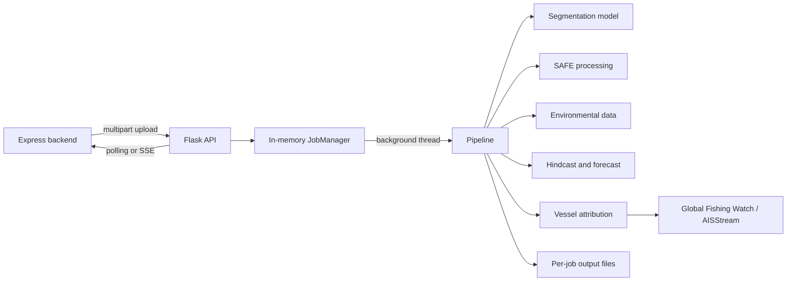

# ML Service Architecture

## Overview

The ML service is a single-process Flask application that runs an asynchronous, nine-stage oil-spill investigation pipeline. The Express backend normally calls this service; the browser should use the backend rather than calling Flask directly.



## Request lifecycle

1. `POST /api/spill/analyze` validates the file type and upload size, then saves a uniquely named input under `uploads/`.
2. `JobManager.create_job()` creates a `queued` job with the requested coordinates, timestamps, drift window, and AIS options.
3. `JobManager.start()` launches a daemon thread. The HTTP endpoint immediately returns `202 Accepted` with the job and stream URLs.
4. The thread calls `pipeline.run_pipeline()` and receives stage updates through a callback.
5. Clients poll the job endpoint or subscribe to its SSE stream. The stream emits a new complete job payload whenever that payload changes.
6. The job reaches `complete`, `failed`, or `cancelled`. The ML-side input is then removed best-effort; output artifacts remain under `outputs/<job-id>/`.

There is no shared queue or durable job store. A restart loses active jobs, and multiple workers do not share job state. Use one worker unless the application is redesigned around a shared queue and durable storage.

## Pipeline stages

| Stage | Main modules | Output / behaviour |
|---|---|---|
| `extraction` | `safe_processor.py`, `preprocessing.py` | Reads SAFE metadata and dual-polarization measurement bands. |
| `preprocessing` | `preprocessing.py` | Validates, resizes, normalizes, and prepares the model input. |
| `model_inference` | `model.py` | Runs the loaded SegFormer or UNet++ model with test-time augmentation. |
| `segmentation` | `model.py`, `preprocessing.py` | Interprets probabilities and writes a mask and visual overlay. |
| `geolocation` | `safe_processor.py` | Converts detected geometry to coordinates and retains polygon data. |
| `environmental_data` | `environment.py`, `insitu_currents.py` | Retrieves available wind/current history and its data-quality summary. |
| `drift_hindcast` | `drift.py` | Estimates a prior drift path, likely source location, and release timing. |
| `drift_forecast` | `environment.py`, `drift.py` | Projects the detected slick forward; the request default is 24 hours. |
| `vessel_attribution` | `ais_attribution.py`, `track_based_attribution.py`, `vessel_risk.py` | Retrieves candidates and ranks evidence from spatial, temporal, track, and anomaly signals. |

The pipeline reports `success`, `warning`, `error`, or `skipped` for each completed stage. A negative detection skips downstream location, environmental, drift, and attribution work. Missing environmental or AIS coverage is reported as a limitation rather than silently replaced with invented evidence.

## Input and geolocation rules

- A Sentinel-1 SAFE archive is identified from its archive structure and supplies product metadata and geolocation.
The API accepts Sentinel-1 SAFE archives packaged as `.zip`. File-size enforcement comes from `MAX_UPLOAD_MB`, which must match the Express gateway limit for large SAFE archives.

## Model loading

At startup, `server.py` selects a device (`cuda` when available, otherwise `cpu`) and resolves a checkpoint in this order:

1. `OIL_SPILL_MODEL_PATH`, if configured and existing;
2. `models/best_model.safetensors` or `models/best_model.safetensor`;
3. the first supported checkpoint discovered in the local model directories.

`model.load_model()` determines the supported model family. If loading fails, the service starts in a `degraded` health state but refuses analysis jobs until a valid checkpoint is available.

## External data boundaries

`environment.py` uses available environmental providers and local in-situ observations as fallbacks. `ais_attribution.py` can use Global Fishing Watch and AISStream only when credentials and coverage are available. Both data families are external evidence inputs: coverage, latency, API limits, and missing data affect the result.

## API state model

```text
queued -> processing -> complete
                    -> failed
queued / processing -> cancelled
```

Each job response includes the ordered stage array, timestamps, terminal error when applicable, and the completed result only after successful execution. Generated files are served only from the matching job directory, using Flask's safe directory serving.

For endpoint and request-field details, see the [ML service README](README.md). For the full application topology, see the [root README](../README.md).
