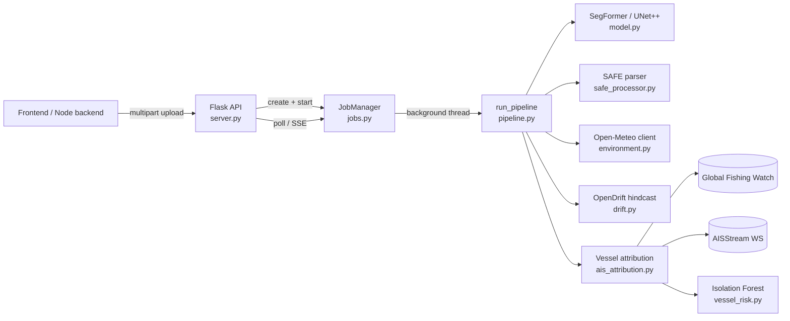
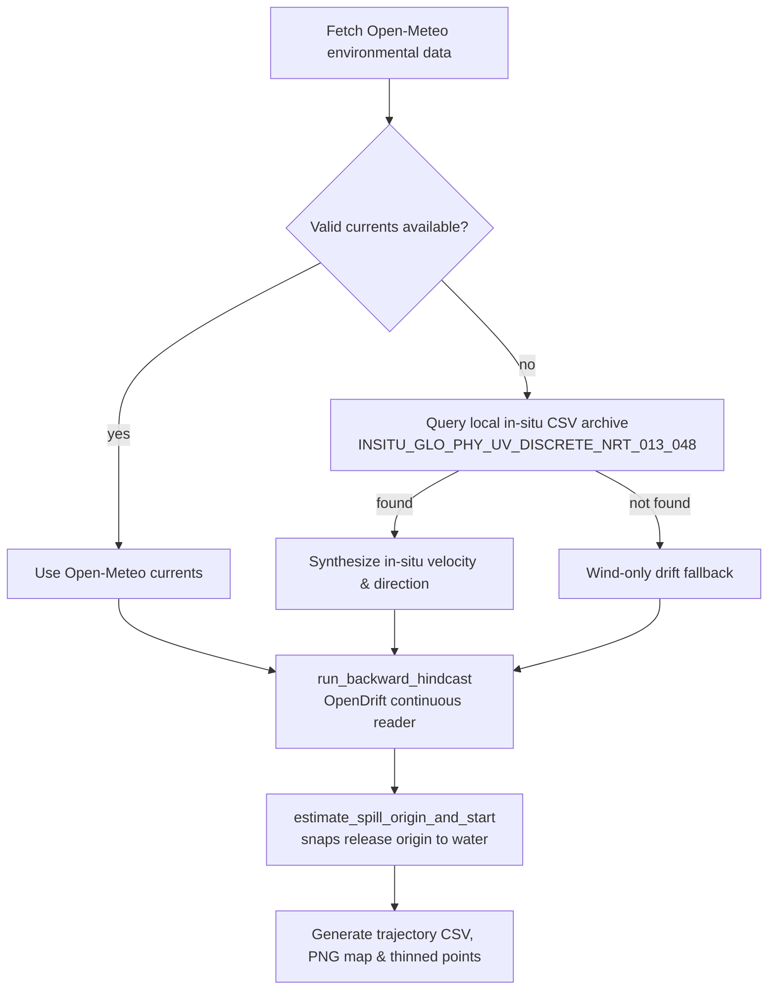

# Architecture — Oil Spill ML Service

## 1. System Overview



The service is a **single Flask process**. There is no separate worker queue —
each upload spawns a plain Python `threading.Thread` (see `jobs.py`) so the
HTTP request returns instantly with a `job_id`, while the actual pipeline runs
in the background. State lives in an in-memory dict (`JobManager._jobs`),
which is why the code comments flag it as swappable for Redis/Celery if you
need multi-process scaling or restart-survival later.

---

## 2. Request Lifecycle

```mermaid
sequenceDiagram
    participant C as Client
    participant S as server.py
    participant J as JobManager (jobs.py)
    participant T as Background Thread
    participant P as pipeline.run_pipeline

    C->>S: POST /api/spill/analyze (file + params)
    S->>S: validate extension, save to uploads/
    S->>J: create_job()
    J-->>S: Job(id, status=queued)
    S->>J: start(job)
    J->>T: spawn thread → _run(job)
    S-->>C: 202 { job_id, status_url, stream_url }

    T->>P: run_pipeline(..., on_stage=callback)
    loop each pipeline stage
        P->>J: on_stage(name, status, message, data)
        J->>J: update job.stages[name], job.updated_at
    end
    P-->>T: result dict
    T->>J: job.result = result; status = complete

    C->>S: GET /jobs/<id>  (or subscribe /jobs/<id>/stream)
    S->>J: get_job(id)
    J-->>C: job.to_dict() (stages + result)
```

`/stream` is a Server-Sent Events endpoint that just polls the same in-memory
job every 0.6s and pushes a new payload whenever it changes, closing once the
job reaches `complete`/`failed` — no message broker involved.

---

## 3. The 8-Stage Pipeline (`pipeline.run_pipeline`)

`STAGE_NAMES` in `pipeline.py` defines the checklist the frontend pre-renders:
`extraction → preprocessing → model_inference → segmentation → geolocation →
environmental_data → drift_hindcast → vessel_attribution`.

### Stage 1 — Extraction
- **Input type detection**: `safe_processor.is_safe_input()` checks the
  filename/zip contents for a `.SAFE` structure.
- **SAFE path**: `safe_processor.process_safe_archive()` — securely unzips
  (zip-slip protected), locates the `.SAFE` product dir, parses
  `manifest.safe` + annotation XMLs for satellite/orbit/acquisition metadata
  and footprint, reads the dual-pol (VV/VH) GeoTIFF measurements, calibrates
  raw DNs to sigma0 dB using the product's own calibration LUT, and builds a
  pseudo-RGB image via `preprocessing.sar_bands_to_pseudo_rgb()` — matching
  the exact channel order (VH, VV) and normalization the model was trained on.
- **Plain image path**: `preprocessing.load_and_validate_image()` — format
  check, OpenCV/PIL load with fallback, converts to RGB.

### Stage 2 — Preprocessing
`preprocessing.preprocess_image()` resizes to the **loaded model's** native
resolution (512×512 for SegFormer, 256×256 for legacy UNet++ — read from
`model._oil_spill_input_size`), applies ImageNet normalization, and uses the
correct interpolation (`INTER_AREA` for SAR-derived pseudo-RGB to match
training, `INTER_LINEAR` otherwise).

### Stage 3 — Model Inference
`model.predict()` runs the forward pass. For SegFormer, logits are
upsampled back to input resolution and softmaxed (2-class: background/oil).
For UNet++, a sigmoid gives a single-channel probability map.

### Stage 4 — Segmentation / Interpretation
`model.interpret_output()` thresholds the probability map into a binary
mask, computes spill coverage %, confidence, and pixel counts.
`preprocessing.generate_mask_and_overlay()` upscales the mask to original
resolution, blends a highlighted overlay + contour outline, and writes a
downscaled JPEG thumbnail (full Sentinel-1 scenes can be tens of thousands
of pixels per side — the thumbnail avoids the frontend downloading the full
overlay just to show a small preview).

*(If no oil spill is detected, the pipeline stops here.)*

### Stage 5 — Geolocation
- **SAFE input**: `safe_processor.extract_spill_centroid_geo()` maps the mask
  centroid to lat/lon using the product's GCPs. Because a single centroid can
  be misleading near a coastline (it can land on dry ground even when most of
  the spill is on water), the pipeline also extracts the spill's actual
  **polygon boundary** (`extract_spill_polygon_points_geo`) and resolves an
  ocean-safe seed point via `drift.resolve_ocean_seed_from_polygon()`,
  classifying each boundary vertex against the GSHHS landmask rather than
  snapping one averaged point.
- **Plain image input**: caller-supplied `latitude`/`longitude`/`timestamp`
  are used directly (no SAR footprint to derive a polygon from), snapped to
  open water via `drift.ensure_ocean_seed()` if needed.
- Either way, if the resolved seed was on land, `spill_lat`/`spill_lon` are
  overwritten with the snapped offshore point *before* Stages 6–8 run — this
  matters because Open-Meteo current queries need a real open-water grid
  cell, not a coastal/land cell.

### Stage 6 — Environmental Data
`environment.fetch_environmental_history()` queries **Open-Meteo**:
- Ocean currents: Marine API (SMOC model). Coastal/land grid cells return
  null currents for every hour, so `get_ocean_currents_nearest_valid()` fans
  out to nearby open-water points (up to 1.5° radius) before giving up.
  A literal `0.0` reading (not `null`) means "not computed yet" and is
  treated as missing, not a real calm reading.
  **Coverage limit: SMOC data only exists from Jan 2022 onward.**
- Wind: Historical Archive API (ERA5 reanalysis, back to 1940), falling back
  to the Forecast API only for very recent dates.

Wind and current validity are tracked **independently** (`has_valid_wind`,
`has_valid_currents`) — a pre-2022 scene can have perfectly good wind data
even with zero ocean-current coverage from this source.

### Stage 7 — Backward Drift Hindcast
This is a **coastline-aware OpenDrift particle simulation**, run backward in
time from the detection point using Open-Meteo ocean currents (or Copernicus In-Situ Marine CSV fallback) and wind history:



- **`run_backward_hindcast`**: wraps the hourly time series (currents + wind)
  in a custom OpenDrift `ContinuousReader` and runs `OceanDrift` with a 3%
  windage factor, `coastline_action=previous` (a stranded particle stays at its
  last valid water position instead of reporting an inland origin).
- **`insitu_currents.py`**: provides spatial and temporal querying over the
  local Copernicus Marine In-Situ Near-Real-Time observations CSV
  (`cmems_obs-ins_glo_phy-cur_nrt_argo_irr_EWCT-NSCT_*.csv`), extracting
  surface velocity components $u$ (EWCT) and $v$ (NSCT) from matching platforms.
- `estimate_spill_origin_and_start()` picks the most plausible release point
  along the trajectory: an explicit release-age target if given, otherwise a
  detected "coastal stranding" (particle stops moving for ≥6h), otherwise the
  full multi-day lookback horizon — always snapped to water, never inland.
- Outputs: `*_trajectory.csv` (full hourly path with current/wind vectors),
  `*_trajectory.png` (map plot), and a thinned `drift_trajectory_points`
  list embedded in the JSON result for frontend map rendering.

### Stage 8 — Vessel Attribution (AIS)
Orchestrated by `ais_attribution.run_attribution()`:

1. **Candidate collection** (`collect_ais_candidates`) — queries Global
   Fishing Watch's 4Wings presence API (gridded, always available with a
   token) and, if configured, AISStream (live/recent WebSocket feed with
   true position tracks). Determines a **data mode** per vessel:
   `TRACK` (real position history — full trajectory scoring possible),
   `PRESENCE_ONLY` (gridded presence only), or `UNAVAILABLE`.
2. **Trajectory reconstruction** (`reconstruct_trajectories`,
   `track_based_attribution.py`) — interpolates vessel position at the
   spill detection time and at the estimated release time/location from
   Stage 7.
3. **Scoring** — for `TRACK`-mode vessels, `track_based_attribution.py`
   combines: spatial proximity to the hindcast origin, temporal overlap
   with the estimated release window, drift-consistency (does the vessel's
   own path resemble the current-driven drift?), speed-anomaly detection,
   and a vessel-type risk prior. For all candidates, `vessel_risk.py`'s
   **Isolation Forest** (trained offline, loaded via `joblib`) scores
   behavioral anomaly (0–1, calibrated against stored p01/p99 anchors) from
   8 real positional features (distance, time gaps, speed, heading
   variation) — never synthetic placeholder vessels.
4. **Ranking & explanation** — candidates are ranked by a weighted overall
   score, tiered into a confidence label, and given a human-readable
   `build_explanation()` string citing the specific evidence.
5. Skippable per-request via `skip_ais=true`.

---

## 4. Model Loading (`model.py`)

- `load_model()` inspects the file extension: `.safetensors` → builds a
  SegFormer-B2 (`SEGFORMER_B2_CONFIG`, 2-class head) via
  `transformers`/`safetensors`, `strict=True` state-dict load (fails loudly
  on any shape mismatch rather than silently ignoring missing weights).
  `.pth` → legacy `segmentation_models_pytorch` UNet++ (ResNet34 encoder).
- The loaded model is tagged with `_oil_spill_model_type` and
  `_oil_spill_input_size` attributes, which `preprocessing.py` and
  `model.predict()` read to pick the correct resize resolution and
  softmax-vs-sigmoid decision path — one inference codepath serves both
  architectures.
- Model is loaded **once at process startup** in `server.py`; if loading
  fails the server still starts (so `/api/health` is inspectable) but
  `/api/spill/analyze` returns `503` until a valid checkpoint is available.

---

## 5. External Services & Fallback Philosophy

| Concern | Primary | Fallback |
|---|---|---|
| Ocean currents | Open-Meteo Marine (SMOC, 2022+) | Copernicus In-Situ CSV (`INSITU_GLO_PHY_UV_DISCRETE_NRT_013_048`) in `data/` |
| Wind | Open-Meteo Archive (ERA5, 1940+) | Open-Meteo Forecast (recent only) |
| Vessel positions | Global Fishing Watch 4Wings | AISStream (live/recent) / PRESENCE_ONLY mode |
| Coastline/landmask | OpenDrift GSHHS reader (local) | — (raises `LandmaskUnavailableError`, never silently assumes water) |

The consistent design principle across the codebase: **never fabricate data**.
Missing values stay `None` end-to-end (never coerced to `0.0`), failed
external calls are caught, logged, and surfaced in the job result rather than
silently degrading the output, and every "no data" state is explicit
(`UNAVAILABLE`, `has_valid_currents: false`, etc.) instead of implied.

---

## 6. Concurrency & Scaling Notes

- Single Flask process, `threading.Thread` per job, in-memory job store
  (`jobs.py`). Fine for a single-instance deployment; **does not survive a
  process restart** and doesn't scale across multiple workers/machines.
- To scale: swap `JobManager` for a Redis-backed queue (Celery/RQ) without
  touching `pipeline.py` — `run_pipeline()` is already a pure function that
  takes plain arguments and reports progress through a callback, so it can
  be called from a Celery task the same way `jobs.py` calls it from a thread.
- Recommended to run gunicorn with `-w 1` unless model loading is made
  per-worker-safe (each worker would otherwise load its own copy of the
  model into GPU/CPU memory).